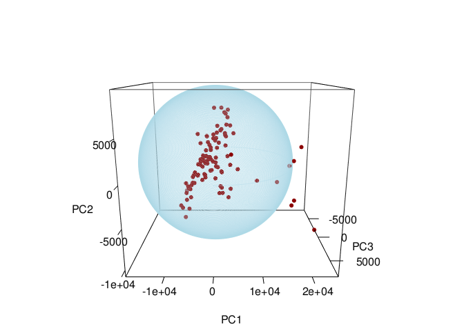

<!-- README.md is generated from README.Rmd. Please edit that file -->
<!-- badges: start -->

# HotellingEllipse 

[](https://www.repostatus.org/#active)
[](https://github.com/ChristianGoueguel/HotellingEllipse/actions)
[](https://app.codecov.io/gh/ChristianGoueguel/HotellingEllipse?branch=master)
[](https://lifecycle.r-lib.org/articles/stages.html#stable)
[](https://CRAN.R-project.org/package=HotellingEllipse)
[](https://cran.r-project.org/package=HotellingEllipse)
[](https://cran.r-project.org/package=HotellingEllipse)
[](https://opensource.org/licenses/MIT)

<!-- badges: end -->

`HotellingEllipse` computes the lengths of the semi-minor and semi-major
axes for plotting Hotelling ellipse at 95% and 99% confidence intervals
(which is based on Hotelling’s T-squared test). The package also
provides the *x*-*y* coordinates at user-defined confidence intervals.

## Installation

Install `HotellingEllipse` from CRAN:

``` r
install.packages("HotellingEllipse")
```

Install the development version from GitHub:

``` r
# install.packages("remotes")
remotes::install_github("ChristianGoueguel/HotellingEllipse")
```

## Usage

Below is an overview of how `HotellingEllipse` can help draw a
confidence ellipse:

-   using `FactoMineR::PCA()` we first perform Principal Component
    Analysis (PCA) from a LIBS spectral dataset `data("specData")` and
    extract the PCA scores.

-   with `ellipseParam()` we get the Hotelling’s T-squared statistic
    along with the values of the semi-minor and semi-major axes.
    Whereas, `ellipseCoord()` provides the *x* and *y* coordinates for
    drawing the Hotelling ellipse at user-defined confidence interval.

-   using `ggplot2::ggplot()` and `ggforce::geom_ellipse()` we plot the
    scatterplot of PCA scores as well as the corresponding Hotelling
    ellipse which represents the confidence region for the joint
    variables at 99% and 95% confidence intervals.

**Step 1.** Load the package.

``` r
#library(HotellingEllipse)
devtools::load_all()
```

**Step 2.** Load LIBS dataset.

``` r
data("specData", package = "HotellingEllipse")
```

**Step 3.** Perform principal component analysis.

``` r
set.seed(123)
pca_mod <- specData %>%
  select(where(is.numeric)) %>%
  PCA(scale.unit = FALSE, graph = FALSE)
```

**Step 4.** Extract PCA scores.

``` r
pca_scores <- pca_mod %>%
  pluck("ind", "coord") %>%
  as_tibble() %>%
  print()
#> # A tibble: 100 × 5
#>      Dim.1    Dim.2  Dim.3   Dim.4 Dim.5
#>      <dbl>    <dbl>  <dbl>   <dbl> <dbl>
#>  1 25306.  -10831.  -1851.   -83.4 -560.
#>  2   -67.3   1137.  -2946.  2495.  -568.
#>  3 -1822.     -22.0 -2305.  1640.  -409.
#>  4 -1238.    3734.   4039. -2428.   379.
#>  5  3299.    4727.   -888. -1089.   262.
#>  6  5006.     -49.5  2534.  1917.  -970.
#>  7 -8325.   -5607.    960. -3361.   103.
#>  8 -4955.   -1056.   2510.  -397.  -354.
#>  9 -1610.    1271.  -2556.  2268.  -760.
#> 10 19582.    2289.    886.  -843.  1483.
#> # ℹ 90 more rows
```

**Step 5.** Run `ellipseParam()` for the first two principal components
(**k = 2**). We want to compute the length of the semi-axes of the
Hotelling ellipse (denoted **a** and **b**) when the first principal
component, PC1, is on the *x*-axis (**pcx = 1**) and, the second
principal component, PC2, is on the *y*-axis (**pcy = 2**).

``` r
res_2PCs <- ellipseParam(data = pca_scores, k = 2, pcx = 1, pcy = 2)
```

``` r
str(res_2PCs)
#> List of 4
#>  $ Tsquare     : tibble [100 × 1] (S3: tbl_df/tbl/data.frame)
#>   ..$ value: num [1:100] 13.8 2.08 1.06 2.82 1.4 ...
#>  $ Ellipse     : tibble [1 × 4] (S3: tbl_df/tbl/data.frame)
#>   ..$ a.99pct: num 19369
#>   ..$ b.99pct: num 10800
#>   ..$ a.95pct: num 15492
#>   ..$ b.95pct: num 8639
#>  $ cutoff.99pct: num 9.76
#>  $ cutoff.95pct: num 6.24
```

-   Semi-axes of the ellipse at 99% confidence level.

``` r
a1 <- pluck(res_2PCs, "Ellipse", "a.99pct")
b1 <- pluck(res_2PCs, "Ellipse", "b.99pct")
```

-   Semi-axes of the ellipse at 95% confidence level.

``` r
a2 <- pluck(res_2PCs, "Ellipse", "a.95pct")
b2 <- pluck(res_2PCs, "Ellipse", "b.95pct")
```

-   Hotelling’s T-squared.

``` r
T2 <- pluck(res_2PCs, "Tsquare", "value")
```

Another way to add Hotelling ellipse on the scatterplot of the scores is
to use the function `ellipseCoord()`. This function provides the *x* and
*y* coordinates of the confidence ellipse at user-defined confidence
interval. The confidence interval `conf.limit` is set at 95% by default.
Here, PC1 is on the *x*-axis (**pcx = 1**) and, the third principal
component, PC3, is on the *y*-axis (**pcy = 3**).

``` r
coord_2PCs_99 <- ellipseCoord(data = pca_scores, pcx = 1, pcy = 3, conf.limit = 0.99, pts = 500)
coord_2PCs_95 <- ellipseCoord(data = pca_scores, pcx = 1, pcy = 3, conf.limit = 0.95, pts = 500)
coord_2PCs_90 <- ellipseCoord(data = pca_scores, pcx = 1, pcy = 3, conf.limit = 0.90, pts = 500)
```

``` r
str(coord_2PCs_99)
#> tibble [500 × 2] (S3: tbl_df/tbl/data.frame)
#>  $ x: num [1:500] 19369 19367 19363 19355 19344 ...
#>  $ y: num [1:500] -5.30e-13 1.06e+02 2.12e+02 3.18e+02 4.24e+02 ...
```

**Step 6.** Plot PC1 *vs.* PC2 scatterplot, with the two corresponding
Hotelling ellipse. Points inside the two elliptical regions are within
the 99% and 95% confidence intervals for the Hotelling’s T-squared.

``` r
pca_scores %>%
  ggplot(aes(x = Dim.1, y = Dim.2)) +
  geom_ellipse(aes(x0 = 0, y0 = 0, a = a1, b = b1, angle = 0), size = .5, linetype = "solid", fill = "white") +
  geom_ellipse(aes(x0 = 0, y0 = 0, a = a2, b = b2, angle = 0), size = .5, linetype = "solid", fill = "white") +
  geom_point(aes(fill = T2), shape = 21, size = 3, color = "black") +
  scale_fill_viridis_c(option = "viridis") +
  geom_hline(yintercept = 0, linetype = "solid", color = "black", size = .2) +
  geom_vline(xintercept = 0, linetype = "solid", color = "black", size = .2) +
  labs(title = "Scatterplot of PCA scores", subtitle = "PC1 vs. PC2", x = "PC1", y = "PC2", fill = "T2", caption = "Figure 1: Hotelling's T2 ellipse obtained\n using the ellipseParam function") +
  theme_grey()
```


Or in the PC1-PC3 subspace at the confidence intervals set at 99, 95 and
90%.

``` r
ggplot() +
  geom_polygon(data = coord_2PCs_99, aes(x, y), color = "black", fill = "white") +
  geom_path(data = coord_2PCs_95, aes(x, y), color = "darkred") +
  geom_path(data = coord_2PCs_90, aes(x, y), color = "darkblue") +
  geom_point(data = pca_scores, aes(x = Dim.1, y = Dim.3, fill = T2), shape = 21, size = 3, color = "black") +
  scale_fill_viridis_c(option = "viridis") +
  geom_hline(yintercept = 0, linetype = "solid", color = "black", size = .2) +
  geom_vline(xintercept = 0, linetype = "solid", color = "black", size = .2) +
  labs(title = "Scatterplot of PCA scores", subtitle = "PC1 vs. PC3", x = "PC1", y = "PC3", fill = "T2", caption = "Figure 2: Hotelling's T2 ellipse obtained\n using the ellipseCoord function") +
  theme_dark()
```


**Note: Hotelling’s T-squared vs. Observations.** The easiest way to
analyze and interpret Hotelling’s T-squared for more than two principal
components, is to plot Hotelling’s T-squared *vs.* Observations, where
the confidence limits are plotted as a line. Thus, observations below
the two lines are within the Hotelling’s T-squared limits. For example,
`ellipseParam()` is used with the first three principal components (**k
= 3**).

``` r
res_3PCs <- ellipseParam(data = pca_scores, k = 3)
```

``` r
str(res_3PCs)
#> List of 3
#>  $ Tsquare     : tibble [100 × 1] (S3: tbl_df/tbl/data.frame)
#>   ..$ value: num [1:100] 9.108 1.37 0.702 1.862 0.925 ...
#>  $ cutoff.99pct: num 12.2
#>  $ cutoff.95pct: num 8.26
```

``` r
tibble(
  T2 = pluck(res_3PCs, "Tsquare", "value"), 
  obs = 1:nrow(pca_scores)
  ) %>%
  ggplot() +
  geom_point(aes(x = obs, y = T2, fill = T2), shape = 21, size = 3, color = "black") +
  geom_segment(aes(x = obs, y = T2, xend = obs, yend = 0), size = .5) +
  scale_fill_gradient(low = "black", high = "red", guide = "none") +
  geom_hline(yintercept = pluck(res_3PCs, "cutoff.99pct"), linetype = "dashed", color = "darkred", linewidth = .5) +
  geom_hline(yintercept = pluck(res_3PCs, "cutoff.95pct"), linetype = "dashed", color = "darkblue", linewidth = .5) +
  annotate("text", x = 80, y = 13, label = "99% limit", color = "darkred") +
  annotate("text", x = 80, y = 9, label = "95% limit", color = "darkblue") +
  labs(x = "Observations", y = "Hotelling’s T-squared (3 PCs)", fill = "T2 stats", caption = "Figure 3: Hotelling’s T-squared vs. Observations") +
  theme_bw()
```


**Update (development version).** In the `ellipseCoord` function, we’ve
incorporated the addition of an extra input parameter called `pcz`,
which is set to `NULL` by default. This addition serves to facilitate
the visualization of Hotelling’s ellipsoid in three dimensions, thereby
enriching the functionality and versatility of the function.

``` r
df <- ellipseCoord(pca_scores, pcx = 1, pcy = 2, pcz = 3)
```

``` r
rgl::setupKnitr(autoprint = TRUE)
rgl::plot3d(
  x = df$x, 
  y = df$y, 
  z = df$z,
  xlab = "PC1", 
  ylab = "PC2", 
  zlab = "PC3",
  type = "l", 
  lwd = 0.5,
  col = "lightblue",
  alpha = 0.5
)
rgl::points3d(
  x = pca_scores$Dim.1, 
  y = pca_scores$Dim.2, 
  z = pca_scores$Dim.3, 
  col = "darkred",
  size = 5,
  add = TRUE
)
rgl::view3d(zoom = .8)
```


