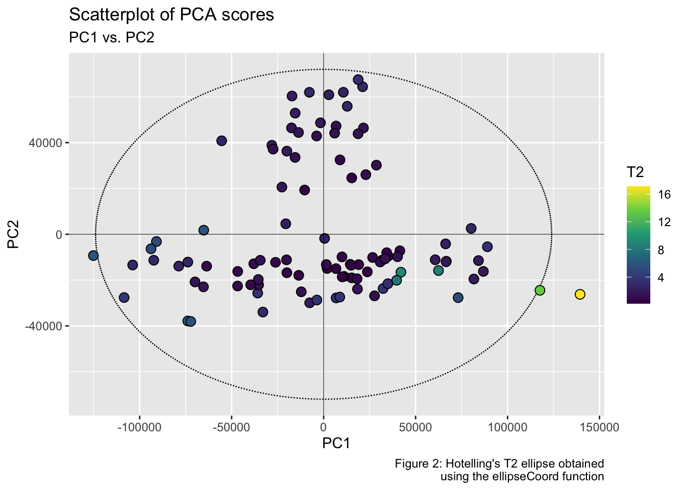
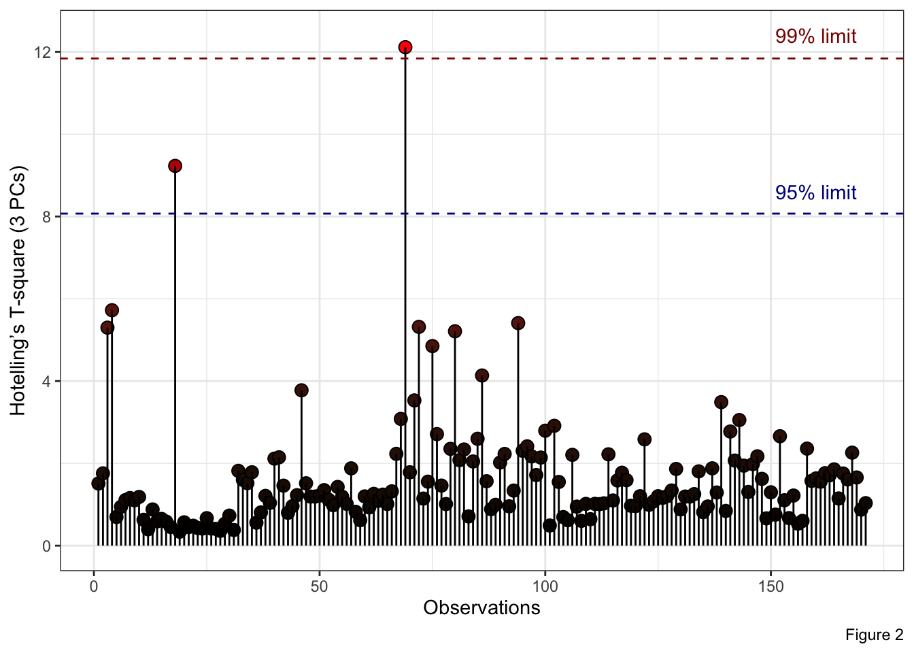
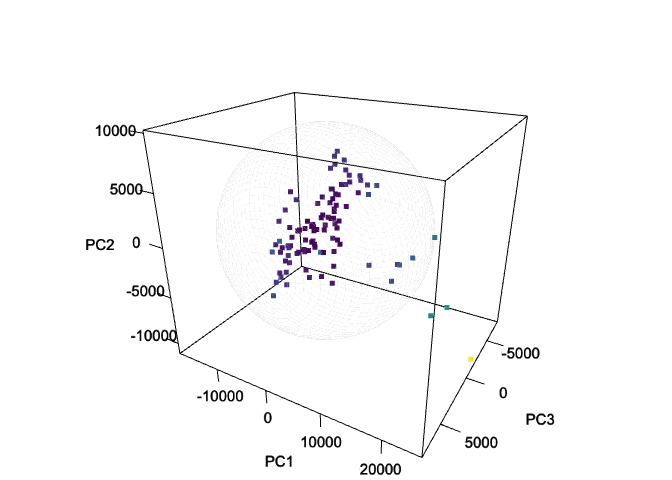
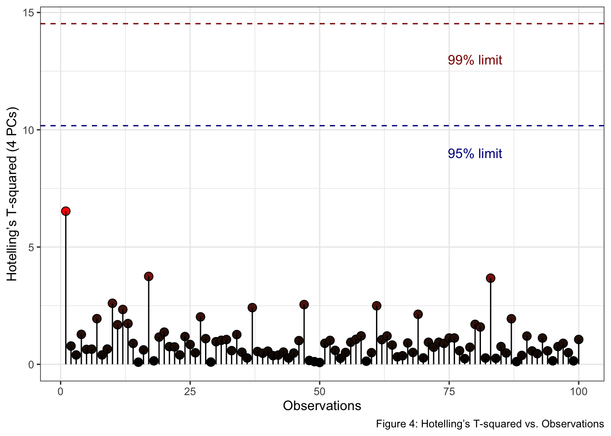

<!-- README.md is generated from README.Rmd. Please edit that file -->
<!-- badges: start -->

# HotellingEllipse 

[](https://www.repostatus.org/#active)
[](https://github.com/ChristianGoueguel/HotellingEllipse/actions/workflows/R-CMD-check.yaml)
[](https://app.codecov.io/gh/ChristianGoueguel/HotellingEllipse?branch=master)
[](https://lifecycle.r-lib.org/articles/stages.html#stable)
[](https://CRAN.R-project.org/package=HotellingEllipse)
[](https://cran.r-project.org/package=HotellingEllipse)
[](https://cran.r-project.org/package=HotellingEllipse)
[](https://opensource.org/licenses/MIT)

<!-- badges: end -->

The `HotellingEllipse` package offers a comprehensive set of functions
that help visualizing multivariate data through Hotelling’s T-squared
ellipses. At its core, the package calculates the crucial parameters
needed for Hotelling’s T-squared ellipse representation: the lengths of
both the semi-minor and semi-major axes. These calculations are
performed for two confidence intervals, 95% and 99%.

`HotellingEllipse` extends its functionality to provide coordinate
points for plotting these ellipses. Users have the flexibility to
generate either two-dimensional or three-dimensional coordinates,
enabling the creation of both planar ellipses and spatial ellipsoids.
While it offers pre-calculated results for common confidence intervals,
it also allows users to specify custom confidence levels. For more
features, please see the package vignette.

## Installation

Install `HotellingEllipse` from CRAN:

``` r
install.packages("HotellingEllipse")
```

Install the development version from GitHub:

``` r
# install.packages("remotes")
remotes::install_github("ChristianGoueguel/HotellingEllipse")
```

## Usage

This section provides a comprehensive step-by-step tutorial on how to
use the `HotellingEllipse` package. This guide will walk you through the
entire process, from data preparation to final visualization.

-   using `FactoMineR::PCA()` we first perform Principal Component
    Analysis (PCA) from a LIBS spectral dataset `data("specData")` and
    extract the PCA scores.

-   with `ellipseParam()` we get the Hotelling’s T-squared statistic
    along with the values of the semi-minor and semi-major axes.
    Whereas, `ellipseCoord()` provides the coordinates for drawing the
    Hotelling ellipse at user-defined confidence interval.

-   using `ggplot2::ggplot()` and `ggforce::geom_ellipse()` we plot the
    scatterplot of PCA scores as well as the corresponding Hotelling’s
    T-squared ellipse which represents the confidence region for the
    joint variables at 99% and 95% confidence intervals.

**Step 1.** Load the package.

``` r
library(HotellingEllipse)
```

**Step 2.** Load LIBS dataset.

``` r
data("specData", package = "HotellingEllipse")
```

**Step 3.** Perform principal component analysis.

``` r
set.seed(123)
pca_mod <- specData %>%
  select(where(is.numeric)) %>%
  PCA(scale.unit = FALSE, graph = FALSE)
```

**Step 4.** Extract PCA scores.

``` r
pca_scores <- pca_mod %>%
  pluck("ind", "coord") %>%
  as_tibble() %>%
  print()
#> # A tibble: 100 × 5
#>      Dim.1    Dim.2  Dim.3   Dim.4 Dim.5
#>      <dbl>    <dbl>  <dbl>   <dbl> <dbl>
#>  1 25306.  -10831.  -1851.   -83.4 -560.
#>  2   -67.3   1137.  -2946.  2495.  -568.
#>  3 -1822.     -22.0 -2305.  1640.  -409.
#>  4 -1238.    3734.   4039. -2428.   379.
#>  5  3299.    4727.   -888. -1089.   262.
#>  6  5006.     -49.5  2534.  1917.  -970.
#>  7 -8325.   -5607.    960. -3361.   103.
#>  8 -4955.   -1056.   2510.  -397.  -354.
#>  9 -1610.    1271.  -2556.  2268.  -760.
#> 10 19582.    2289.    886.  -843.  1483.
#> # ℹ 90 more rows
```

**Step 5.** Run `ellipseParam()` for the first two principal components
(**k = 2**). We want to compute the length of the semi-axes of the
Hotelling ellipse (denoted **a** and **b**) when the first principal
component, PC1, is on the *x*-axis (**pcx = 1**) and, the second
principal component, PC2, is on the *y*-axis (**pcy = 2**).

``` r
res_2PCs <- ellipseParam(pca_scores, k = 2, pcx = 1, pcy = 2)
```

``` r
str(res_2PCs)
#> List of 5
#>  $ Tsquare     : tibble [100 × 1] (S3: tbl_df/tbl/data.frame)
#>   ..$ value: num [1:100] 13.0984 0.0536 0.0428 0.5969 1.0649 ...
#>  $ cutoff.99pct: num 9.76
#>  $ cutoff.95pct: num 6.24
#>  $ nb.comp     : num 2
#>  $ Ellipse     : tibble [1 × 4] (S3: tbl_df/tbl/data.frame)
#>   ..$ a.99pct: num 19369
#>   ..$ b.99pct: num 10800
#>   ..$ a.95pct: num 15492
#>   ..$ b.95pct: num 8639
```

-   Semi-axes of the ellipse at 99% confidence level.

``` r
a1 <- pluck(res_2PCs, "Ellipse", "a.99pct")
b1 <- pluck(res_2PCs, "Ellipse", "b.99pct")
```

-   Semi-axes of the ellipse at 95% confidence level.

``` r
a2 <- pluck(res_2PCs, "Ellipse", "a.95pct")
b2 <- pluck(res_2PCs, "Ellipse", "b.95pct")
```

-   Hotelling’s T-squared.

``` r
T2 <- pluck(res_2PCs, "Tsquare", "value")
```

Another way to add Hotelling ellipse on the scatterplot of the scores is
to use the function `ellipseCoord()`. This function provides the *x* and
*y* coordinates of the confidence ellipse at user-defined confidence
interval. The confidence interval `conf.limit` is set at 95% by default.
Here, PC1 is on the *x*-axis (**pcx = 1**) and, the third principal
component, PC3, is on the *y*-axis (**pcy = 3**).

``` r
coord_2PCs_99 <- ellipseCoord(pca_scores, pcx = 1, pcy = 3, conf.limit = 0.99, pts = 500)
coord_2PCs_95 <- ellipseCoord(pca_scores, pcx = 1, pcy = 3, conf.limit = 0.95, pts = 500)
coord_2PCs_90 <- ellipseCoord(pca_scores, pcx = 1, pcy = 3, conf.limit = 0.90, pts = 500)
```

``` r
str(coord_2PCs_99)
#> tibble [500 × 2] (S3: tbl_df/tbl/data.frame)
#>  $ x: num [1:500] 19369 19367 19363 19355 19344 ...
#>  $ y: num [1:500] -5.30e-13 1.06e+02 2.12e+02 3.18e+02 4.24e+02 ...
```

**Step 6.** Plot PC1 *vs.* PC2 scatterplot, with the two corresponding
Hotelling ellipse. Points inside the two elliptical regions are within
the 99% and 95% confidence intervals for the Hotelling’s T-squared.

``` r
t1 <- round(as.numeric(pca_mod$eig[1,2]), 2)
t2 <- round(as.numeric(pca_mod$eig[2,2]), 2)
t3 <- round(as.numeric(pca_mod$eig[3,2]), 2)
```

``` r
pca_scores %>%
  ggplot(aes(x = Dim.1, y = Dim.2)) +
  geom_ellipse(aes(x0 = 0, y0 = 0, a = a1, b = b1, angle = 0), linewidth = .5, linetype = "solid", fill = "white") +
  geom_ellipse(aes(x0 = 0, y0 = 0, a = a2, b = b2, angle = 0), linewidth = .5, linetype = "solid", fill = "white") +
  geom_point(aes(fill = T2), shape = 21, size = 3, color = "black") +
  scale_fill_viridis_c(option = "viridis") +
  geom_hline(yintercept = 0, linetype = "solid", color = "black", linewidth = .2) +
  geom_vline(xintercept = 0, linetype = "solid", color = "black", linewidth = .2) +
  labs(title = "Scatterplot of PCA scores", subtitle = "PC1 vs. PC2", x = glue("PC1 [{t1}%]"), y = glue("PC2 [{t2}%]"), fill = "T2", caption = "Figure 1: Hotelling’s T2 ellipse obtained\n using the ellipseParam function") +
  theme_grey() +
  theme(
    aspect.ratio = .7,
    panel.grid = element_blank(),
    panel.background = element_rect(
    colour = "black",
    linewidth = .3
    )
  )
```



Or in the PC1-PC3 subspace at the confidence intervals set at 99, 95 and
90%.

``` r
ggplot() +
  geom_polygon(data = coord_2PCs_99, aes(x, y), color = "black", fill = "white") +
  geom_path(data = coord_2PCs_95, aes(x, y), color = "darkred") +
  geom_path(data = coord_2PCs_90, aes(x, y), color = "darkblue") +
  geom_point(data = pca_scores, aes(x = Dim.1, y = Dim.3, fill = T2), shape = 21, size = 3, color = "black") +
  scale_fill_viridis_c(option = "viridis") +
  geom_hline(yintercept = 0, linetype = "solid", color = "black", linewidth = .2) +
  geom_vline(xintercept = 0, linetype = "solid", color = "black", linewidth = .2) +
  labs(title = "Scatterplot of PCA scores", subtitle = "PC1 vs. PC3", x = glue("PC1 [{t1}%]"), y = glue("PC3 [{t3}%]"), fill = "T2", caption = "Figure 2: Hotelling’s T2 ellipse obtained\n using the ellipseCoord function") +
  theme_grey() +
   theme(
    aspect.ratio = .7,
    panel.grid = element_blank(),
    panel.background = element_rect(
    colour = "black",
    linewidth = .3
    )
  )
```



**Note 1: Hotelling’s T-squared Ellipsoid - Visualizing Multivariate
Data in 3D Space.**

The `ellipseCoord` function has an optional parameter `pcz`, which is
set to `NULL` by default. When specified, this parameter enables the
computation of coordinates for Hotelling’s T-squared ellipsoid in
three-dimensional space. In the example below, the 1st, 2nd, and 3rd
components are mapped to the *x*, *y*, and *z*-axis, respectively. The
resulting ellipsoid serves as a three-dimensional confidence region,
encompassing a specified proportion of the data points based on the
chosen confidence level.

``` r
df_ellipsoid <- ellipseCoord(pca_scores, pcx = 1, pcy = 2, pcz = 3, pts = 50)
```

``` r
str(df_ellipsoid)
#> tibble [2,500 × 3] (S3: tbl_df/tbl/data.frame)
#>  $ x: num [1:2500] -2.32e-13 -2.32e-13 -2.32e-13 -2.32e-13 -2.32e-13 ...
#>  $ y: num [1:2500] 6.93e-13 6.93e-13 6.93e-13 6.93e-13 6.93e-13 ...
#>  $ z: num [1:2500] 7745 7745 7745 7745 7745 ...
```

``` r
T2 <- ellipseParam(pca_scores, k = 3)$Tsquare$value
```

``` r
color_palette <- viridisLite::viridis(nrow(pca_scores))
scaled_T2 <- scales::rescale(T2, to = c(1, nrow(pca_scores)))
point_colors <- color_palette[round(scaled_T2)]
```

``` r
rgl::setupKnitr(autoprint = TRUE)
rgl::plot3d(
  x = df_ellipsoid$x, 
  y = df_ellipsoid$y, 
  z = df_ellipsoid$z,
  xlab = "PC1", 
  ylab = "PC2", 
  zlab = "PC3",
  type = "l", 
  lwd = 0.5,
  col = "lightgray",
  alpha = 0.5)
rgl::points3d(
  x = pca_scores$Dim.1, 
  y = pca_scores$Dim.2, 
  z = pca_scores$Dim.3, 
  col = point_colors,
  size = 5,
  add = TRUE)
rgl::bgplot3d({
    par(mar = c(0,0,0,0))
    plot.new()
    color_legend <- as.raster(matrix(rev(color_palette), ncol = 1))
    rasterImage(color_legend, 0.85, 0.1, 0.9, 0.9)
    text(
      x = 0.92, 
      y = seq(0.1, 0.9, length.out = 5), 
      labels = round(seq(min(T2), max(T2), length.out = 5), 2),
      cex = 0.7)
    text(x = 0.92, y = 0.95, labels = "T2", cex = 0.8)})
rgl::view3d(theta = 30, phi = 25, zoom = .8)
```



**Note 2: Analysis of Hotelling’s T-squared Using Multiple Components.**

When dealing with more than two principal components, visualizing
Hotelling’s T-squared becomes challenging in traditional 2D or 3D plots.
A more effective approach for analyzing and interpreting this
multivariate statistic involves plotting Hotelling’s T-squared against
Observations, where the confidence limits are plotted as a line. Thus,
observations below the two lines are within the Hotelling’s T-squared
limits.

In the provided example, we utilize the `ellipseParam()` function with a
cumulative variance threshold of 0.95 (`threshold = 0.95`). This setting
ensures that the analysis captures 95% of the total variance in the
data.

``` r
df <- ellipseParam(pca_scores, threshold = 0.95)
```

``` r
str(df)
#> List of 4
#>  $ Tsquare     : tibble [100 × 1] (S3: tbl_df/tbl/data.frame)
#>   ..$ value: num [1:100] 6.53 0.78 0.399 1.276 0.636 ...
#>  $ cutoff.99pct: num 14.5
#>  $ cutoff.95pct: num 10.2
#>  $ nb.comp     : num 4
```

``` r
tibble(
  T2 = pluck(df, "Tsquare", "value"), 
  obs = 1:nrow(pca_scores)
  ) %>%
  ggplot() +
  geom_point(aes(x = obs, y = T2, fill = T2), shape = 21, size = 3, color = "black") +
  geom_segment(aes(x = obs, y = T2, xend = obs, yend = 0), linewidth = .5) +
  scale_fill_gradient(low = "black", high = "red", guide = "none") +
  geom_hline(yintercept = pluck(df, "cutoff.99pct"), linetype = "dashed", color = "darkred", linewidth = .5) +
  geom_hline(yintercept = pluck(df, "cutoff.95pct"), linetype = "dashed", color = "darkblue", linewidth = .5) +
  annotate("text", x = 80, y = 13, label = "99% limit", color = "darkred") +
  annotate("text", x = 80, y = 9, label = "95% limit", color = "darkblue") +
  labs(x = "Observations", y = "Hotelling’s T-squared (4 PCs)", fill = "T2 stats", caption = "Figure 4: Hotelling’s T-squared vs. Observations") +
  theme_bw()
```


