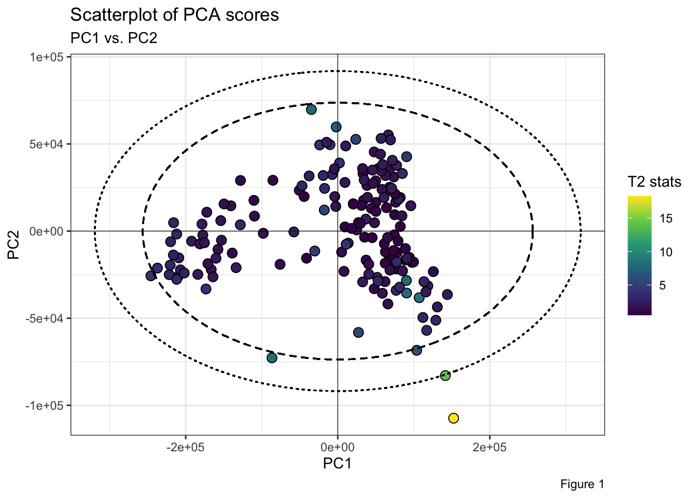

<!-- README.md is generated from README.Rmd. Please edit that file -->

# HotellingEllipse

<!-- badges: start -->
<!-- badges: end -->

The HotellingEllipse package computes the Hotelling’s T<sup>2</sup>
Statistic and provides the confidence ellipse semi-axes parameters for a
bivariate scatter plot, at 95% and 99% confidence levels.

## Installation

You can install the released version of HotellingEllipse from
[CRAN](https://CRAN.R-project.org) with:

``` r
install.packages("HotellingEllipse")
```

And the development version from [GitHub](https://github.com/) with:

``` r
# install.packages("devtools")
devtools::install_github("ChristianGoueguel/HotellingEllipse")
```

## Example

As an example, using `FactoMineR::PCA()` we first perform the Principal
Component Analysis (PCA) from a LIBS spectral dataset
`data("LIBS_spec")` and extract the PCA scores. Then, from
`HotellingEllipse()` we calculate the Hotelling T<sup>2</sup> statistic
for the first two principal components, as well as the values of the
semi-axis parameters for drawing the confidence ellipse. And finally,
using `ggplot()` and `ggforce::geom_ellipse()` we plot the PCA scores
scatter plot and the corresponding Hotelling’s T<sup>2</sup> ellipses at
99% and 95% confidence levels.

**Step 1.** Load the packages.

``` r
library(HotellingEllipse)
library(tidyverse)
devtools::load_all()
```

**Step 2.** Load LIBS dataset into R session.

``` r
data("LIBS_spec")
```

**Step 3.** Perform principal component analysis.

``` r
set.seed(123)
pca_mod <- LIBS_spec %>%
  select(where(is.numeric)) %>%
  FactoMineR::PCA(scale.unit = FALSE, graph = FALSE)
```

**Step 4.** Extract PCA scores.

``` r
pca_scores <- pca_mod %>%
  pluck("ind", "coord") %>%
  as_tibble() %>%
  print()
#> # A tibble: 171 x 5
#>      Dim.1   Dim.2   Dim.3   Dim.4   Dim.5
#>      <dbl>   <dbl>   <dbl>   <dbl>   <dbl>
#>  1 144168. -36399.   2228.   -670.  13805.
#>  2 118520. -31465.  16300. -20686. -13872.
#>  3  90303. -28356.  31340. -60615.  15157.
#>  4 107107. -38209.  24897. -60366.  19449.
#>  5  74350.  -2148.  29814.  -8351.    494.
#>  6  97511. -17932.  22254. -15406.  -4195.
#>  7  82142.  19297. -34299. -12498.   -648.
#>  8  76261.  16566. -34382. -16293.    137.
#>  9  73705.  31091. -22577. -17182.   2438.
#> 10  68042.  25124. -26064. -19389.   6051.
#> # … with 161 more rows
```

**Step 5.** Run `HotellingEllipse()` for the first three principal
components (k = 3). Also, we want to compute the parameters of the
ellipses semiminor and semimajor axes when the first principal
component, PC1 (pcx = 1), is on the *x*-axis and, the second principal
component, PC2 (pcy = 2), is on the *y*-axis.

``` r
res_Tsq <- HotellingEllipse(data = pca_scores, k = 3, pcx = 1, pcy = 2)
```

``` r
str(res_Tsq)
#> List of 4
#>  $ Tsquared    : tibble[,1] [171 × 1] (S3: tbl_df/tbl/data.frame)
#>   ..$ statistic: num [1:171] 1.51 1.757 5.299 5.722 0.697 ...
#>  $ Ellipse     : tibble[,4] [1 × 4] (S3: tbl_df/tbl/data.frame)
#>   ..$ a1: num 356318
#>   ..$ b1: num 102385
#>   ..$ a2: num 294169
#>   ..$ b2: num 84527
#>  $ cutoff.99pct: num 11.8
#>  $ cutoff.95pct: num 8.07
```

Retrieve ellipse parameters at 99% confidence level.

``` r
a1 <- pluck(res_Tsq, "Ellipse", "a1")
b1 <- pluck(res_Tsq, "Ellipse", "b1")
```

Retrieve ellipse parameters at 95% confidence level.

``` r
a2 <- pluck(res_Tsq, "Ellipse", "a2")
b2 <- pluck(res_Tsq, "Ellipse", "b2")
```

Retrieve Hotelling’s T<sup>2</sup> statistic.

``` r
T2 <- pluck(res_Tsq, "Tsquared", "statistic")
```

**Step 6.** Plot PC1 *vs.* PC2 scatterplot of the PCA scores for all
observations, with the corresponding Hotelling’s T<sup>2</sup> ellipses.
Points inside the two elliptical regions are within the 99% and 95%
confidence limits for T<sup>2</sup>.

``` r
pca_scores %>%
  ggplot(aes(x = Dim.1, y = Dim.2)) +
  ggforce::geom_ellipse(aes(x0 = 0, y0 = 0, a = a1, b = b1, angle = 0), size = .5, linetype = "dotted") + 
  ggforce::geom_ellipse(aes(x0 = 0, y0 = 0, a = a2, b = b2, angle = 0), size = .5, linetype = "dashed") +
  geom_point(aes(fill = T2), shape = 21, size = 3, color = "black") +
  scale_fill_viridis_c(option = "viridis") +
  geom_hline(yintercept = 0, linetype = "solid", color = "black", size = .2) +
  geom_vline(xintercept = 0, linetype = "solid", color = "black", size = .2) +
  labs(x = "PC1", y = "PC2", fill = "T2 stats") +
  theme_bw()
```


**Note:** The easiest way to analyze and interpret Hotelling’s
T<sup>2</sup> for more than two principal components, is to plot
Observations *vs.* Hotelling’s T<sup>2</sup> where the confidence limits
are plotted as a line. Thus, observations below the two lines are within
the T<sup>2</sup> limits.

``` r
tibble(T2 = T2, obs = 1:nrow(pca_scores)) %>%
  ggplot(aes(x = obs, y = T2)) +
  geom_point(aes(fill = T2), shape = 21, size = 3, color = "black") +
  geom_line() +
  scale_fill_viridis_c(option = "viridis") +
  geom_hline(yintercept = pluck(res_Tsq, "cutoff.99pct"), linetype = "dashed", color = "darkred", size = .5) +
  geom_hline(yintercept = pluck(res_Tsq, "cutoff.95pct"), linetype = "dashed", color = "darkblue", size = .5) +
  annotate("text", x = 160, y = 12.3, label = "99% limit", color = "darkred") +
  annotate("text", x = 160, y = 8.5, label = "95% limit", color = "darkblue") +
  labs(x = "Observations", y = "Hotelling's T-squared", fill = "T2 stats") +
  theme_bw()
```


