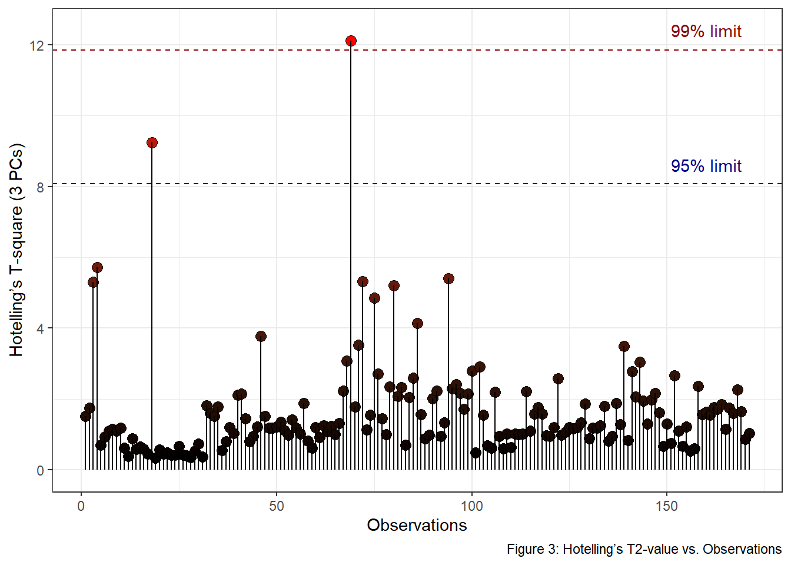

<!-- README.md is generated from README.Rmd. Please edit that file -->
<!-- badges: start -->

# HotellingEllipse 

[](https://github.com/ChristianGoueguel/HotellingEllipse/actions)
[](https://codecov.io/gh/ChristianGoueguel/HotellingEllipse)
[](https://lifecycle.r-lib.org/articles/stages.html#stable)
[](https://CRAN.R-project.org/package=HotellingEllipse)
<!-- badges: end -->

`HotellingEllipse` computes the lengths of the semi-minor and semi-major
axes for plotting Hotelling ellipse at 95% and 99% confidence intervals.
The package also provides the *x*-*y* coordinates at user-defined
confidence intervals.

## Installation

Install `HotellingEllipse` from CRAN:

``` r
install.packages("HotellingEllipe")
```

Install the development version from GitHub:

``` r
# install.packages("remotes")
remotes::install_github("ChristianGoueguel/HotellingEllipse")
```

## Usage

Below is an overview of how `HotellingEllipse` can help draw a
confidence ellipse:

-   using `FactoMineR::PCA()` we first perform Principal Component
    Analysis (PCA) from a LIBS spectral dataset `data("specData")` and
    extract the PCA scores.

-   with `ellipseParam()` we get the T<sup>2</sup> value along with the
    values of the semi-minor and semi-major axes. Whereas,
    `ellipseCoord()` provides the *x* and *y* coordinates for drawing
    the Hotelling ellipse at user-defined confidence interval.

-   using `ggplot2::ggplot()` and `ggforce::geom_ellipse()` we plot the
    scatterplot of PCA scores as well as the corresponding Hotelling
    ellipse which represents the confidence region for the joint
    variables at 99% and 95% confidence intervals.

**Step 1.** Load the package.

``` r
library(HotellingEllipse)
```

**Step 2.** Load LIBS dataset into R session.

``` r
data("specData")
```

**Step 3.** Perform principal component analysis.

``` r
set.seed(123)
pca_mod <- specData %>%
  select(where(is.numeric)) %>%
  PCA(scale.unit = FALSE, graph = FALSE)
```

**Step 4.** Extract PCA scores.

``` r
pca_scores <- pca_mod %>%
  pluck("ind", "coord") %>%
  as_tibble() %>%
  print()
#> # A tibble: 100 × 5
#>      Dim.1   Dim.2   Dim.3   Dim.4   Dim.5
#>      <dbl>   <dbl>   <dbl>   <dbl>   <dbl>
#>  1 -35818. -25670.  -1410. -18987. -27824.
#>  2 -12142. -25112. -10597.  -6783. -17026.
#>  3  80218.   2544. -27594. -19345.   3397.
#>  4 -55409.  40806. -14685. -11184. -15158.
#>  5  66703. -11798.  26979.   6451. -18152.
#>  6  21652.  46396. -11037.    467.  -3676.
#>  7 -10316.  19311.   -545. -13258.   3631.
#>  8  66331.  -4200.  21980.  23341.  -1542.
#>  9  41474.  -7211.  13901.  11204.   3586.
#> 10   6716. -15011.   3620.   3784.    241.
#> # … with 90 more rows
```

**Step 5.** Run `ellipseParam()` for the first two principal components
(**k = 2**). We want to compute the length of the semi-axes of the
Hotelling ellipse (denoted **a** and **b**) when the first principal
component, PC1, is on the *x*-axis (**pcx = 1**) and, the second
principal component, PC2, is on the *y*-axis (**pcy = 2**).

``` r
res_2PCs <- ellipseParam(data = pca_scores, k = 2, pcx = 1, pcy = 2)
```

``` r
str(res_2PCs)
#> List of 4
#>  $ Tsquare     : tibble [100 × 1] (S3: tbl_df/tbl/data.frame)
#>   ..$ value: num [1:100] 3.46 1.4 2.74 2.68 2.64 ...
#>  $ Ellipse     : tibble [1 × 4] (S3: tbl_df/tbl/data.frame)
#>   ..$ a.99pct: num 154988
#>   ..$ b.99pct: num 89990
#>   ..$ a.95pct: num 123969
#>   ..$ b.95pct: num 71980
#>  $ cutoff.99pct: num 9.76
#>  $ cutoff.95pct: num 6.24
```

-   Semi-axes of the ellipse at 99% confidence level.

``` r
a1 <- pluck(res_2PCs, "Ellipse", "a.99pct")
b1 <- pluck(res_2PCs, "Ellipse", "b.99pct")
```

-   Semi-axes of the ellipse at 95% confidence level.

``` r
a2 <- pluck(res_2PCs, "Ellipse", "a.95pct")
b2 <- pluck(res_2PCs, "Ellipse", "b.95pct")
```

-   Hotelling’s T<sup>2</sup>.

``` r
T2 <- pluck(res_2PCs, "Tsquare", "value")
```

Another way to add Hotelling ellipse on the scatterplot of the scores is
to use the function `ellipseCoord()`. This function provides the *x* and
*y* coordinates of the confidence ellipse at user-defined confidence
interval. The confidence interval `confi.limit` is set at 95% by
default.

``` r
coord_2PCs <- ellipseCoord(data = pca_scores, pcx = 1, pcy = 2, conf.limit = 0.95, pts = 500)
```

``` r
str(coord_2PCs)
#> tibble [500 × 2] (S3: tbl_df/tbl/data.frame)
#>  $ x: num [1:500] 123969 123959 123930 123881 123812 ...
#>  $ y: num [1:500] -5.74e-12 9.06e+02 1.81e+03 2.72e+03 3.62e+03 ...
```

**Step 6.** Plot PC1 *vs.* PC2 scatterplot, with the two corresponding
Hotelling ellipse. Points inside the two elliptical regions are within
the 99% and 95% confidence limits for T<sup>2</sup>.

``` r
pca_scores %>%
  ggplot(aes(x = Dim.1, y = Dim.2)) +
  geom_ellipse(aes(x0 = 0, y0 = 0, a = a1, b = b1, angle = 0), size = .5, linetype = "dotted", fill = "white") +
  geom_ellipse(aes(x0 = 0, y0 = 0, a = a2, b = b2, angle = 0), size = .5, linetype = "dashed", fill = "white") +
  geom_point(aes(fill = T2), shape = 21, size = 3, color = "black") +
  scale_fill_viridis_c(option = "viridis") +
  geom_hline(yintercept = 0, linetype = "solid", color = "black", size = .2) +
  geom_vline(xintercept = 0, linetype = "solid", color = "black", size = .2) +
  labs(title = "Scatterplot of PCA scores", subtitle = "PC1 vs. PC2", x = "PC1", y = "PC2", fill = "T2", caption = "Figure 1: Hotelling's T2 ellipse obtained\n using the ellipseParam function") +
  theme_grey()
```


``` r
ggplot() +
  geom_ellipse(data = coord_2PCs, aes(x0 = x, y0 = y, a = 1, b = 1, angle = 0), size = .5, linetype = "dashed") +
  geom_point(data = pca_scores, aes(x = Dim.1, y = Dim.2, fill = T2), shape = 21, size = 3, color = "black") +
  scale_fill_viridis_c(option = "viridis") +
  geom_hline(yintercept = 0, linetype = "solid", color = "black", size = .2) +
  geom_vline(xintercept = 0, linetype = "solid", color = "black", size = .2) +
  labs(title = "Scatterplot of PCA scores", subtitle = "PC1 vs. PC2", x = "PC1", y = "PC2", fill = "T2", caption = "Figure 2: Hotelling's T2 ellipse obtained\n using the ellipseCoord function") +
  theme_grey()
```


**Note:** The easiest way to analyze and interpret Hotelling’s
T<sup>2</sup> for more than two principal components, is to plot
Hotelling’s T<sup>2</sup> *vs.* Observations, where the confidence
limits are plotted as a line. Thus, observations below the two lines are
within the T<sup>2</sup> limits. For example, `ellipseParam()` is used
with the first three principal components (**k = 3**).

``` r
res_3PCs <- ellipseParam(data = pca_scores, k = 3)
```

``` r
str(res_3PCs)
#> List of 3
#>  $ Tsquare     : tibble [100 × 1] (S3: tbl_df/tbl/data.frame)
#>   ..$ value: num [1:100] 2.283 0.921 1.806 1.767 1.743 ...
#>  $ cutoff.99pct: num 12.2
#>  $ cutoff.95pct: num 8.26
```

``` r
tibble(
  T2 = pluck(res_3PCs, "Tsquare", "value"), 
  obs = 1:nrow(pca_scores)
  ) %>%
  ggplot() +
  geom_point(aes(x = obs, y = T2, fill = T2), shape = 21, size = 3, color = "black") +
  geom_segment(aes(x = obs, y = T2, xend = obs, yend = 0), size = .5) +
  scale_fill_gradient(low = "black", high = "red", guide = "none") +
  geom_hline(yintercept = pluck(res_3PCs, "cutoff.99pct"), linetype = "dashed", color = "darkred", size = .5) +
  geom_hline(yintercept = pluck(res_3PCs, "cutoff.95pct"), linetype = "dashed", color = "darkblue", size = .5) +
  annotate("text", x = 160, y = 12.4, label = "99% limit", color = "darkred") +
  annotate("text", x = 160, y = 8.6, label = "95% limit", color = "darkblue") +
  labs(x = "Observations", y = "Hotelling’s T-square (3 PCs)", fill = "T2 stats", caption = "Figure 3: Hotelling’s T2-value vs. Observations") +
  theme_bw()
```


