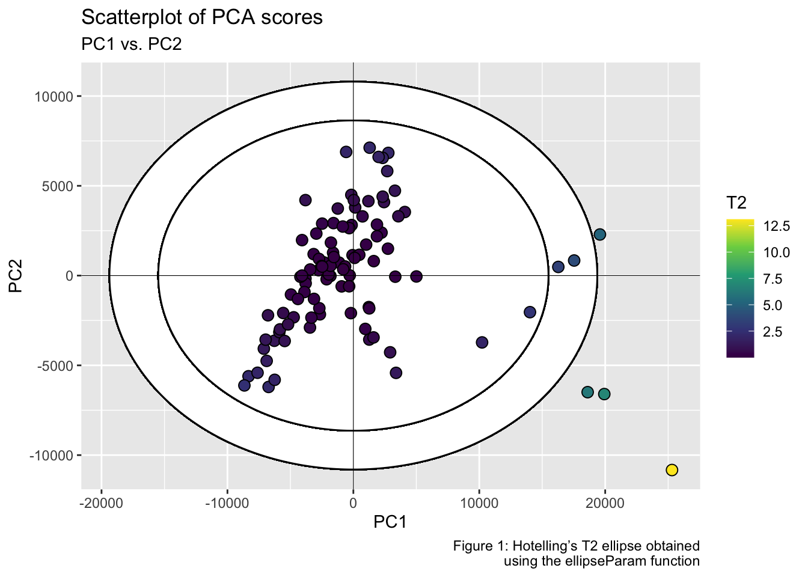

<!-- README.md is generated from README.Rmd. Please edit that file -->
<!-- badges: start -->

# HotellingEllipse 

<!-- badges: end -->

The HotellingEllipse package computes the Hotelling’s T<sup>2</sup>
statistic to compare multivariate data. For bivariate data, it provides
the semi-minor and semi-major axes of a confidence ellipse at 95% and
99% confidence intervals. The package also calculates the *x*-*y*
coordinate points of Hotelling ellipse at user-defined confidence
interval.

## Installation

You can install the released version of HotellingEllipse from
[GitHub](https://github.com/):

``` r
# install.packages("remotes")
remotes::install_github("ChristianGoueguel/HotellingEllipse")
```

## Example

Using `FactoMineR::PCA()` we first perform Principal Component Analysis
(PCA) from a LIBS spectral dataset `data("specData")` and extract the
PCA scores. Then, from `ellipseParam()` we calculate the Hotelling
T<sup>2</sup> statistic for the first two principal components, and the
values of the semi-major and semi-minor axes for drawing the confidence
ellipse. And finally, using `ggplot2::ggplot()` and
`ggforce::geom_ellipse()` we plot the scatterplot of PCA scores as well
as the corresponding Hotelling’s T<sup>2</sup> ellipse which represents
the confidence region for the joint variables at 99% and 95% confidence
intervals.

**Step 1.** Load the packages.

``` r
library(HotellingEllipse)
library(dplyr)
library(purrr)
library(ggplot2)
```

**Step 2.** Load LIBS dataset into R session.

``` r
data("specData")
```

**Step 3.** Perform principal component analysis.

``` r
set.seed(123)
pca_mod <- specData %>%
  select(where(is.numeric)) %>%
  FactoMineR::PCA(scale.unit = FALSE, graph = FALSE)
```

**Step 4.** Extract PCA scores.

``` r
pca_scores <- pca_mod %>%
  pluck("ind", "coord") %>%
  as_tibble() %>%
  print()
#> # A tibble: 171 x 5
#>      Dim.1   Dim.2   Dim.3   Dim.4   Dim.5
#>      <dbl>   <dbl>   <dbl>   <dbl>   <dbl>
#>  1 144168. -36399.   2228.   -670.  13805.
#>  2 118520. -31465.  16300. -20686. -13872.
#>  3  90303. -28356.  31340. -60615.  15157.
#>  4 107107. -38209.  24897. -60366.  19449.
#>  5  74350.  -2148.  29814.  -8351.    494.
#>  6  97511. -17932.  22254. -15406.  -4195.
#>  7  82142.  19297. -34299. -12498.   -648.
#>  8  76261.  16566. -34382. -16293.    137.
#>  9  73705.  31091. -22577. -17182.   2438.
#> 10  68042.  25124. -26064. -19389.   6051.
#> # … with 161 more rows
```

**Step 5.** Run `ellipseParam()` for the first two principal components
(k = 2). We want to compute the principal axes of the ellipses (denoted
**a** and **b**) when the first principal component, PC1, is on the
*x*-axis (pcx = 1) and, the second principal component, PC2, is on the
*y*-axis (pcy = 2).

``` r
res_2PCs <- ellipseParam(data = pca_scores, k = 2, pcx = 1, pcy = 2)
```

``` r
str(res_2PCs)
#> List of 4
#>  $ Tsquared    : tibble[,1] [171 × 1] (S3: tbl_df/tbl/data.frame)
#>   ..$ statistic: num [1:171] 2.28 2.65 8 8.63 1.05 ...
#>  $ Ellipse     : tibble[,4] [1 × 4] (S3: tbl_df/tbl/data.frame)
#>   ..$ a1: num 319536
#>   ..$ b1: num 91816
#>   ..$ a2: num 256487
#>   ..$ b2: num 73699
#>  $ cutoff.99pct: num 9.52
#>  $ cutoff.95pct: num 6.14
```

Retrieve ellipse parameters at 99% confidence level.

``` r
a1 <- pluck(res_2PCs, "Ellipse", "a1")
b1 <- pluck(res_2PCs, "Ellipse", "b1")
```

Retrieve ellipse parameters at 95% confidence level.

``` r
a2 <- pluck(res_2PCs, "Ellipse", "a2")
b2 <- pluck(res_2PCs, "Ellipse", "b2")
```

Retrieve Hotelling’s T<sup>2</sup> statistic (for the first two PCs).

``` r
T2 <- pluck(res_2PCs, "Tsquared", "statistic")
```

**Step 6.** Plot PC1 *vs.* PC2 scatterplot, with the two corresponding
Hotelling’s T<sup>2</sup> ellipses. Points inside the two elliptical
regions are within the 99% and 95% confidence limits for T<sup>2</sup>.

``` r
pca_scores %>%
  ggplot(aes(x = Dim.1, y = Dim.2)) +
  ggforce::geom_ellipse(aes(x0 = 0, y0 = 0, a = a1, b = b1, angle = 0), size = .5, linetype = "dotted") + 
  ggforce::geom_ellipse(aes(x0 = 0, y0 = 0, a = a2, b = b2, angle = 0), size = .5, linetype = "dashed") +
  geom_point(aes(fill = T2), shape = 21, size = 3, color = "black") +
  scale_fill_viridis_c(option = "viridis") +
  geom_hline(yintercept = 0, linetype = "solid", color = "black", size = .2) +
  geom_vline(xintercept = 0, linetype = "solid", color = "black", size = .2) +
  labs(title = "Scatterplot of PCA scores", subtitle = "PC1 vs. PC2", x = "PC1", y = "PC2", fill = "T2 stats", caption = "Figure 1") +
  theme_bw()
```


**Note:** The easiest way to analyze and interpret Hotelling’s
T<sup>2</sup> for more than two principal components, is to plot
Observations *vs.* Hotelling’s T<sup>2</sup> where the confidence limits
are plotted as a line. Thus, observations below the two lines are within
the T<sup>2</sup> limits. In the example below, `ellipseParam()` is ran
with the first three principal components (i.e., k = 3).

``` r
res_3PCs <- ellipseParam(data = pca_scores, k = 3)
```

``` r
tibble::tibble(
  T2 = pluck(res_3PCs, "Tsquared", "statistic"), 
  obs = 1:nrow(pca_scores)
  ) %>%
  ggplot() +
  geom_point(aes(x = obs, y = T2, fill = T2), shape = 21, size = 3, color = "black") +
  geom_segment(aes(x = obs, y = T2, xend = obs, yend = 0), size = .5) +
  scale_fill_gradient(low = "black", high = "red", guide = "none") +
  geom_hline(yintercept = pluck(res_3PCs, "cutoff.99pct"), linetype = "dashed", color = "darkred", size = .5) +
  geom_hline(yintercept = pluck(res_3PCs, "cutoff.95pct"), linetype = "dashed", color = "darkblue", size = .5) +
  annotate("text", x = 160, y = 12.4, label = "99% limit", color = "darkred") +
  annotate("text", x = 160, y = 8.6, label = "95% limit", color = "darkblue") +
  labs(x = "Observations", y = "Hotelling's T-squared (3 PCs)", fill = "T2 stats", caption = "Figure 2") +
  theme_bw()
```


**Note:** Run the function `ellipseCoord()`, if you want the *x* and *y*
coordinate points of the confidence ellipse instead. By default the
confidence level `confi.limit` is set at 95%.

``` r
xy_coord <- ellipseCoord(
    data = pca_scores, 
    pcx = 1, 
    pcy = 2, 
    conf.limit = 0.95, 
    pts = 200
    ) %>%
  print()
#> # A tibble: 200 x 2
#>          x        y
#>      <dbl>    <dbl>
#>  1 256487. 1.06e-12
#>  2 256359. 2.33e+ 3
#>  3 255975. 4.65e+ 3
#>  4 255337. 6.97e+ 3
#>  5 254444. 9.28e+ 3
#>  6 253297. 1.16e+ 4
#>  7 251898. 1.39e+ 4
#>  8 250248. 1.62e+ 4
#>  9 248348. 1.84e+ 4
#> 10 246201. 2.07e+ 4
#> # … with 190 more rows
```

``` r
ggplot() +
  ggforce::geom_ellipse(data = xy_coord, aes(x0 = x, y0 = y, a = 1, b = 1, angle = 0), size = .5, linetype = "dashed") +
  geom_point(data = pca_scores, aes(x = Dim.1, y = Dim.2, fill = T2), shape = 21, size = 3, color = "black") +
  scale_fill_viridis_c(option = "viridis") +
  geom_hline(yintercept = 0, linetype = "solid", color = "black", size = .2) +
  geom_vline(xintercept = 0, linetype = "solid", color = "black", size = .2) +
  labs(title = "Scatterplot of PCA scores", subtitle = "PC1 vs. PC2", x = "PC1", y = "PC2", fill = "T2 stats", caption = "Figure 3") +
  theme_bw()
```



Likewise, we can compute the ellipse *x* and *y* coordinates within the
PC1-PC3 subspace.

``` r
xy_coord_2 <- 
  ellipseCoord(
    data = pca_scores, 
    pcx = 1, 
    pcy = 3, 
    conf.limit = 0.95, 
    pts = 200
    )
```


